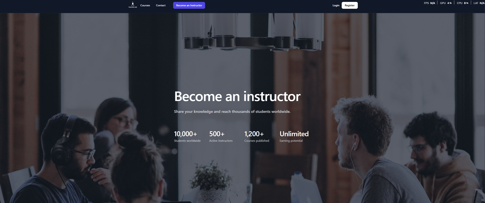
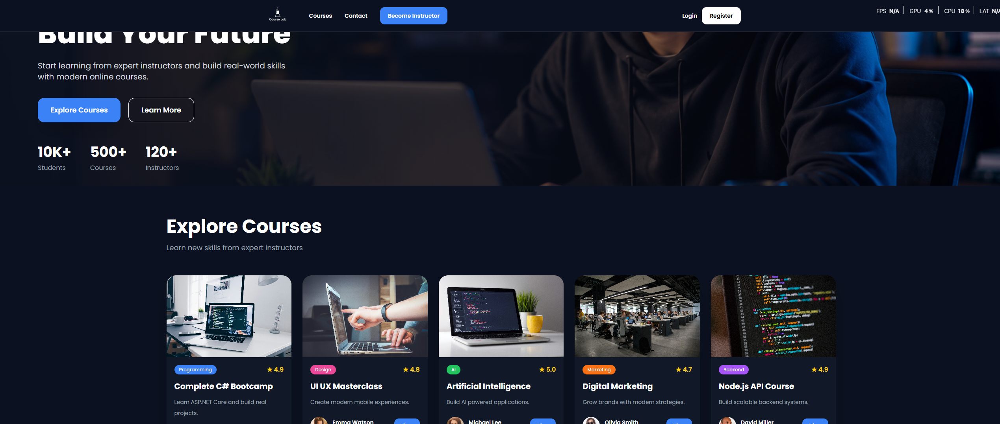
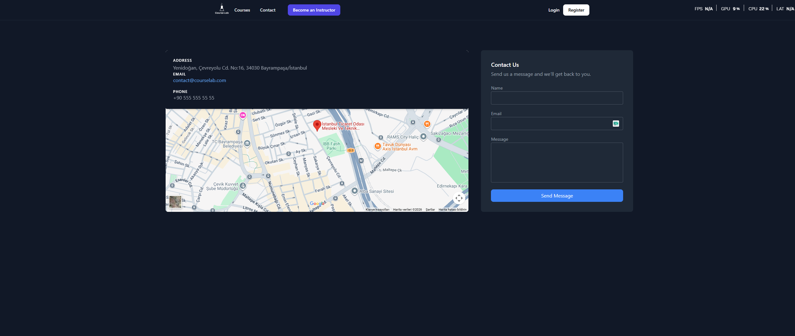

# 🧪 CourseLab

> Modern online learning platform built with ASP.NET Core



---

## 📋 About

**CourseLab** is a full-featured online course platform inspired by Udemy. Students can browse and enroll in courses, while instructors can publish and manage their own content. The platform features a clean dark-themed UI with a seamless user experience.

---

## ✨ Features

- 🏠 **Home Page** — Hero section with course listings and platform statistics (10K+ students, 500+ courses, 120+ instructors)
- 🔐 **Authentication** — Sign in and Sign up pages with email/password
- 📚 **Courses Page** — Browse courses by category with ratings and instructor info
- 🎓 **Become an Instructor** — Dedicated page for instructor registration
- 📬 **Contact Page** — Contact form with address, email, phone and Google Maps integration


---

## 📸 Screenshots

### Home Page


### Courses


### Sign In


### Sign Up


### Contact


---

## 🛠️ Tech Stack

| Layer | Technology |
|-------|-----------|
| Backend | ASP.NET Core (MVC) |
| Frontend | HTML, CSS, JavaScript |
| Database | SQL Server |
| ORM | Entity Framework Core |
| Auth | ASP.NET Core Identity |

---

## 🚀 Getting Started

### Prerequisites

- [.NET SDK](https://dotnet.microsoft.com/download) (6.0 or later)
- [SQL Server](https://www.microsoft.com/en-us/sql-server)
- [Visual Studio 2022](https://visualstudio.microsoft.com/) or VS Code

### Installation

1. **Clone the repository**
   ```bash
   git clone https://github.com/your-username/courselab.git
   cd courselab
   ```

2. **Configure the database connection**

   Update `appsettings.json`:
   ```json
   "ConnectionStrings": {
     "DefaultConnection": "Server=YOUR_SERVER;Database=CourseLabDB;Trusted_Connection=True;"
   }
   ```

3. **Apply migrations**
   ```bash
   dotnet ef database update
   ```

4. **Run the project**
   ```bash
   dotnet run
   ```

5. Open your browser and navigate to `https://localhost:5001`

---

## 📁 Project Structure

```
CourseLab/
├── Controllers/        # MVC Controllers
├── Models/             # Entity models
├── Views/              # Razor views
├── wwwroot/            # Static files (CSS, JS, images)
├── Migrations/         # EF Core migrations
└── appsettings.json    # Configuration
```

---

## 🤝 Contributing

Pull requests are welcome. For major changes, please open an issue first to discuss what you'd like to change.

---

## 📄 License

This project is licensed under the [MIT License](LICENSE).

---

<p align="center">Made with ❤️ using ASP.NET Core</p>
